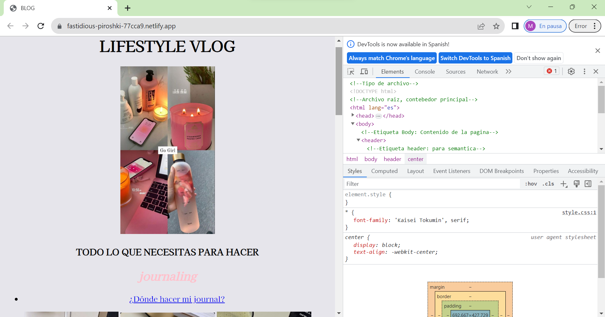

# MI PRIMER PAGINA WEB 💗⭐👩🏻‍💻🧠

Este fue el primer proyecto que se trabajó en el bootcamp de Tecnolochicas PRO Summer camp 💜 y con el que empezamos a tener contacto con HTML y entender de qué manera funciona para así poder crear la base de nuestras páginas para posteriormente irles dando vida con CSS.

******

Espero que te puedas basar con este proyecto que se trabajó en el bootcamp de Tecnolochicas PRO Summer camp 💜, y si te llama la atención empezar a programar, puedes guiarte buscando esta página 📲 que a mí me ayudo ya que son todas las etiquetas de HTML que puedes utilizar para ir creando una página increíble, sólo es cuestión de que te tomes un tiempo para poderlas explorar y así hacer de tu página algo hermoso. 💗

🔗 https://www.w3schools.com/html/

*****
En este apartado podrás encontrar el link de este proyecto, disfrútalo y guíate para hacer tu propia página! 🖥️💻🧠🙌🏻

🔗 https://fastidious-piroshki-77cca9.netlify.app/

*****

***Derechos de autor para: Arlén Dorantes*** 

